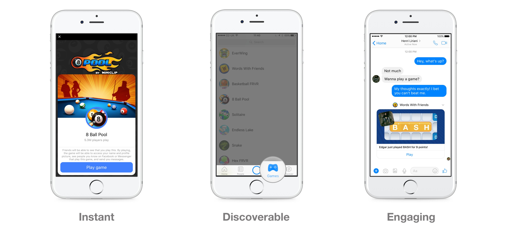
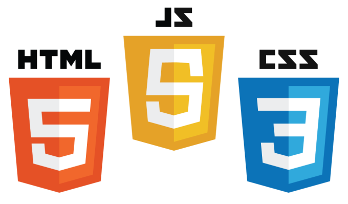
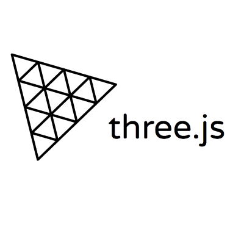
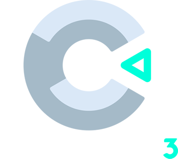

<!-- _class: gaia lead -->

# <!--fit--> Videojuegos con HTML5

Andrés Ávila Acosta
[@andaviaco](https://github.com/andaviaco)

---
# 💁‍♂️ Yo

- Lead Software Engineer
- Developer Circles Guadalajara
- Estudiante de Ing. Computación
- 4+ años como desarrollador

---
# ¿Qué es HTML5?


---
<!-- _class: invert -->


---
<style scoped>
h1 {
  text-align: center;
}
</style>
<!-- _class: invert -->


---

<!-- _class: invert -->
## HTML5: Ventajas 👍
* Juegos multiplataforma

* Desarrollo en plataformas móviles nativas

* Fácil distribución

* Compatibles con nuevas plataformas como Facebook Instant Games

---
## HTML5: Desventajas 👎
* Menor rendimiento que una plataforma nativa

* Calidad de los gráficos


---
##  Instant Games



---
<!-- _class: lead -->
# <!-- fit --> ¿Qué necesito aprender?

---


---
<style scoped>
h3 {
  text-align: center;
}
</style>

### Diseño y modelado


---
<!-- _class: lead -->
# <!-- fit --> ¿Cómo se hace un videojuego con HTML5?

---
## Elemento canvas
```html
<!-- index.html -->

<!doctype html>
<html>
  <head>
    <title>My Awesome Game</title>
  </head>
  <body>
    <canvas id="main-canvas" width="600" height="800"></canvas>
    <script src="main.js"></script>
  </body>
</html>
```

---
## Dibujo 2D
```js
// main.js

const assets = require('./assets.js');

const canvas = document.getElementById('main-canvas');
const context = canvas.getContext('2d');

assets.loadImage('images/green_blob.png').then(img => {
    context.drawImage(img, 25, 25);
});
```

---
## Animación
```javascript
// main.js

function drawGame() {
  entities.forEach(entity => {
    entity.draw(gameCanvas);
  });
  requestAnimationFrame(drawGame);
}
```

---
## Almacenamiento de datos
#### Local Storage
- Almacenar información del usuario en el dispositivo
- Es eliminado al limpiar el caché
```js
// Alamcenar progreso del jugador

localStorage.setItem('game_state', JSON.stringify(gameState));
```

---
# Frameworks y herramientas
<!-- _class: lead  -->

---
<style scoped>
h3 {
  text-align: center;
}
</style>
### 2D


---
### 3D
<style scoped>
h3 {
  text-align: center;
}
</style>



---

### Audio
<style scoped>
h3 {
  text-align: center;
}
</style>


---
<style scoped>
h3 {
  text-align: center;
}
</style>

### Motores


---
### Editores (Game Maker)
<style scoped>
h3 {
  text-align: center;
}
</style>



---
# Eligiendo la mejor herramienta
* ¿Qué tipo de juego quiero?
* ¿Dónde lo quiero jugar?
* ¿Qué tipo de graficos quiero que tenga?


---
# El "Dream Team"
Conocimiento multidiciplinario.
- Diseño gráfico y animación
- Audio
- Desarrollo
- Matemáticas y física
- Marketing

---
# Recursos
HTML5 Game Engines
https://html5gameengine.com

Matemáticas esenciales para programadores de videojugos
http://www.essentialmath.com/book.htm

---
# Más recursos gratuitos
Música, efectos de sonido y texturas libres de derechos
https://soundimage.org

Gráficos grátis
http://hasgraphics.com/

Arte para videojuegos
https://opengameart.org/

Blog enfocado en la industria de los videojuegos
http://www.lostgarden.com

---
<!-- _class: lead -->
# ¿Preguntas?


---
<!-- _class: lead -->
# ¡Gracias!
[@andaviaco](https://github.com/andaviaco)
